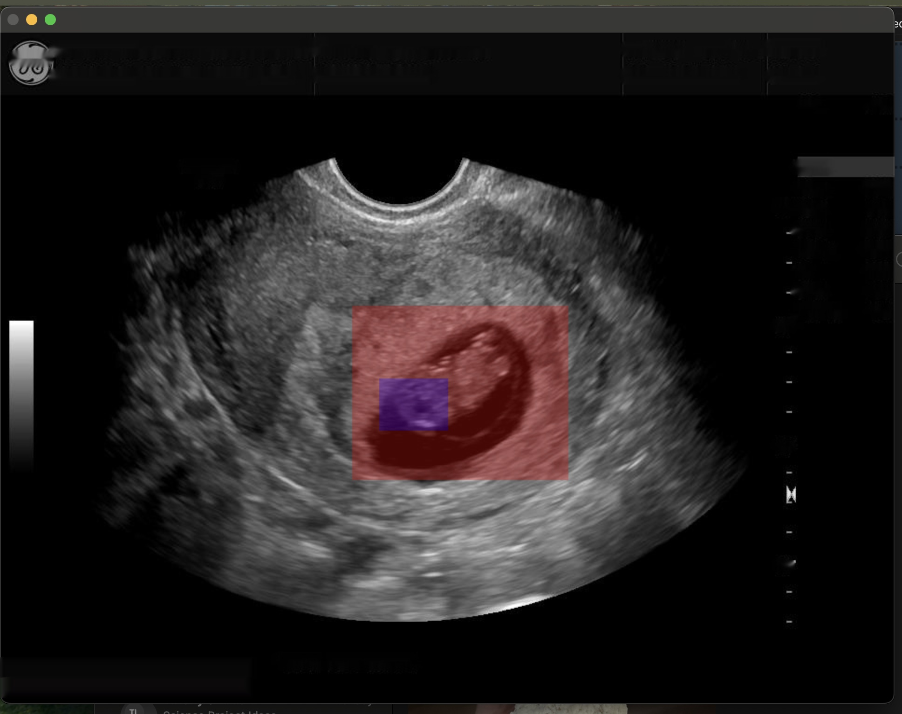
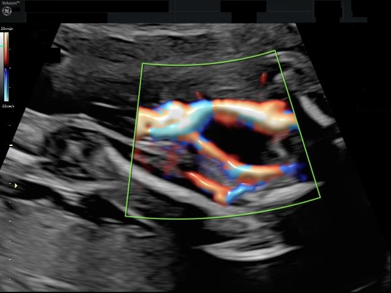
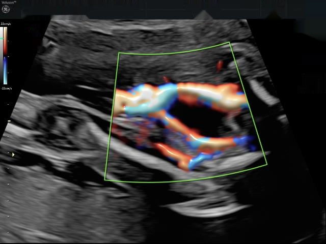
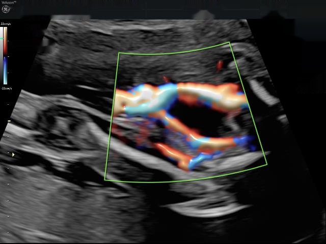

# Blind
This is a very general repository for the support functions/applications used for blinding ultrasound and other images containing information that needs to be removed (i.e. patient data or even text that may correlate to different categories).

## Change in AI backend from TF to Pytorch.
These functions continue to use openCV2-python (and others) but switched to using a pytorch backend and switching to easy OCR.  The easy OCR method seems to be working well but needs slight "tweaks" or tuning out of the box to correctly ID the necessary text but not over/under identify non-specific regions of the image.  Additionally, slight changes in the inpaint method and a just black polygons can be used to cover the identified text boxes.

## Current functions subject to change and updating (27June26)
This is still a work in progress and requires additional testing in docker env using Ubuntu or eq.

The pyproject.toml file is for a macOS UV managed venv.

More to follow as code changes from TF to pytorch for this work.

## Examples
While similar the functions have slightly different responses to the original work (anecdotal observation) but overall the same model training response.

### Using a basic image.
The following image used the included .png and very simple colored square intersection to look at misidentification along with basic easy to observer text.

This is using an input .png with block

Very slight modification from the published work.

Using prior inpaint/line method (Calhoun et al.)

### Prior work derived example

This is using an input .jpg with block

Very slight modification from the published work. using filledpoly for bboxes

Using prior inpaint/line method (Calhoun et al.)

## References

#### PyTorch:

https://pytorch.org/

#### Easy OCR:

https://www.jaided.ai/easyocr/

#### OpenCV2

https://opencv.org/

#### Original Publication
The old_code folder has a summary of the code use for the prior publications.

Calhoun, B.C., Uselman, H. and Olle, E.W. (2024), Development of Artificial Intelligence Image Classification Models for Determination of Umbilical Cord Vascular Anomalies. J Ultrasound Med, 43: 881-897. https://doi.org/10.1002/jum.16418

