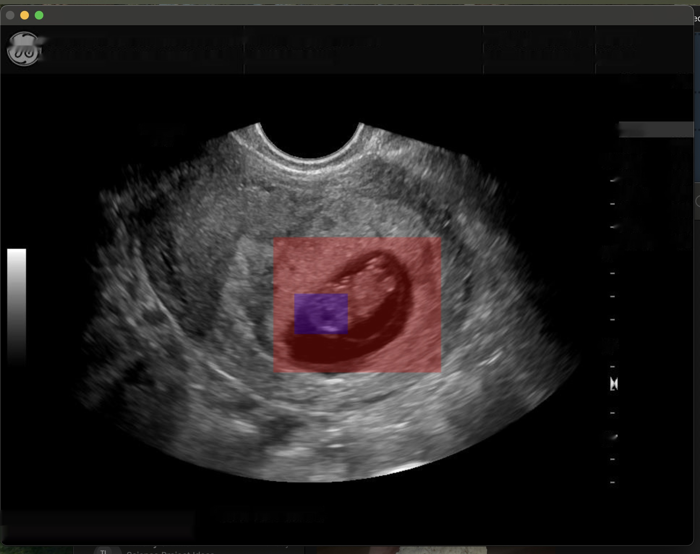
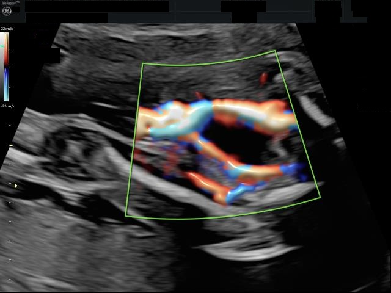
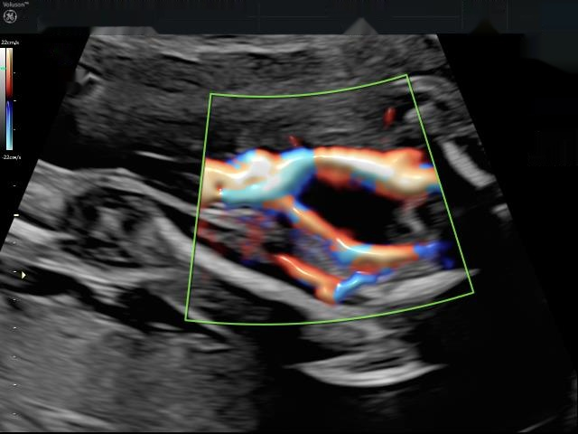
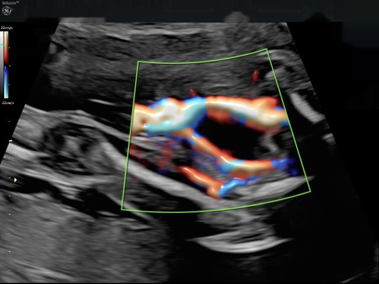

# Blind
This is a very general repository for the support functions/applications used for blinding ultrasound and other images containing information that needs to be removed (i.e. patient data or even text that may correlate to different categories).

## Annotation best practices
It has been observed (ewo unpublished) that the location, size and color of the annotating text may interfere with downstream data analysis (object detection and image classification).  No exact criteria have been established some possible best practices for annotating ultrasound images for later AI/ML analysis are:
1.  Clearly mark using a color that is significantly different than colors that may occur on doppler etc.  Such as a yellow or green.
2.  Large enough to be detected by the underlying model (i.e 6 to 8 pt text is a minimum but 10+ has a higher probability of detection when random noise is added.)
3.  Minimal overlap with the region of interest and potentially well clear of important anatomy.
4.  Don't worry if some overlap of minimal information containing regions.
5.  Arrows, lines, boxes an etc may not be detected by the OCR methods.  However if the markings are present at roughly equal probability in the different classes it may have limited impact on image classification and nearly no impact on object detection.

Most of these suggestions are already followed but this is a reiteration of for sonographers and doctors.

## NOTES:
Sept, 8 2026.  The function ocr_blind2 is being used and developed as a stand alone will work on combining ocr_blind to be either a CLI blinding method and an online API method that does not store the initial image or detected data.

Sept, 8 2026. Working on testing the range of detectability of different text with and without random noise being added to testing images.

Sept, 8 2026.  Need to change the call for mps (in macOS) to remove the pin memory warning.

## Change in AI backend from TF to Pytorch.
These functions continue to use openCV2-python (and others) but switched to using a pytorch backend and switching to easy OCR.  The easy OCR method seems to be working well but needs slight "tweaks" or tuning out of the box to correctly ID the necessary text but not over/under identify non-specific regions of the image.  Additionally, slight changes in the inpaint method and a just black polygons can be used to cover the identified text boxes.

## Current functions subject to change and updating (27June26)
This is still a work in progress and requires additional testing in docker env using Ubuntu or eq.

The pyproject.toml file is for a macOS UV managed venv.

More to follow as code changes from TF to pytorch for this work.

## Examples
While similar the functions have slightly different responses to the original work (anecdotal observation) but overall the same model training response.

### Using a basic image.
The following image used the included .png and very simple colored square intersection to look at misidentification along with basic easy to observer text.

This is using an input .png with block

Very slight modification from the published work.

Using prior inpaint/line method (Calhoun et al.)

### Prior work derived example

This is using an input .jpg with block

Very slight modification from the published work. using filledpoly for bboxes

Using prior inpaint/line method (Calhoun et al.)

### Facial blinding

A basic facial detection an blur are added for basic de-identification.  The image used for testing is:

"People photography is hard" by mendhak is licensed under CC BY-SA 2.0.

## References

#### PyTorch:

https://pytorch.org/

#### Easy OCR:

https://www.jaided.ai/easyocr/

#### OpenCV2

https://opencv.org/

#### Original Publication
The old_code folder has a summary of the code use for the prior publications.

Calhoun, B.C., Uselman, H. and Olle, E.W. (2024), Development of Artificial Intelligence Image Classification Models for Determination of Umbilical Cord Vascular Anomalies. J Ultrasound Med, 43: 881-897. https://doi.org/10.1002/jum.16418

